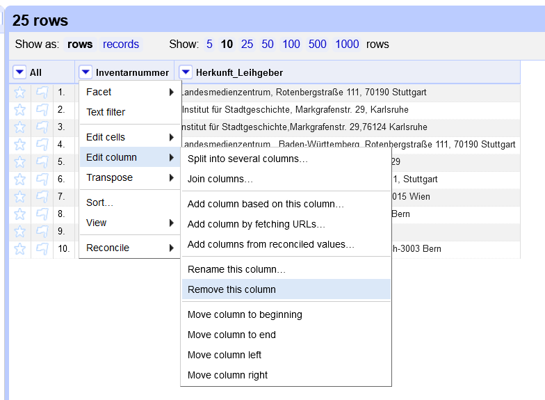
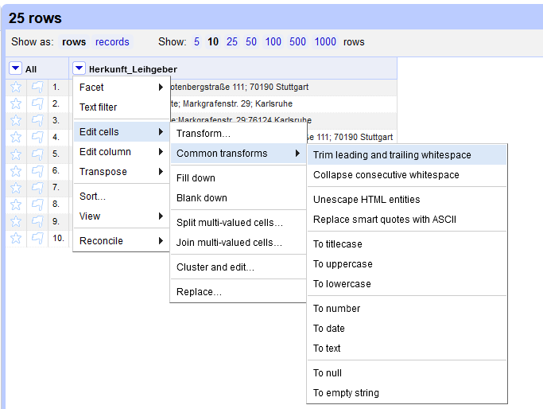

# Anwendungsbeispiel

Folgendes Beispiel stammte aus der geraden laufenden Datenbankumstellung am Haus der Geschichte Baden-Württemberg (HdGBW). Der Wechsel erfolgt von einer Eigenentwicklung aus dem Jahre 2001 nach ImdasPro, unterstützt vom [BSZ](https://www.bsz-bw.de/MusIS.html).
Konkret geht es das Überspielen von Adressangaben zu Körperschaften aus dem Feld "Herkunft/Leihgeber" bei Objektdatensätzen. Die alte Datenbank enthält keinen Adress- oder sonstige Stammdatenverwaltung, was zum einem bedeutet, dass dieses Feld ein Freitextfeld ist, und zum anderen, dass die selben Informationen bei jedem Objektdatensatz erneut eingegeben werden müssen. Entsprechend variantenreich können die Einträge ausfallen.

Die Schreibanweisung für das Feld lautet: Name; Straße Hausnummer, PLZ Ort. Tatsächlich finden sich in den Feldinhalten Schreibvarianten, Typos und auch ausgelassene Informationen wie z. B. fehlende Straßennamen.

Für diese kleine Einführung in OpenRefine wurde von 25 exemplarischen Datensätzen die Inhalte des Feldes als Datengrundlage für die folgenden Übungen in der [Herkunft.xlsx](./datasets/Herkunft.xlsx) ausgelesen.

## Der IMDAS-Import

Für die Datenmigration werden die Daten in Exceltabellen in ausgelesen. 
Damit Imdas diese Datensätze akzeptiert, müssen die Tabellen bestimmte Anforderungen erfüllen, u. a. müssen die zu importierenden Felder in der richtigen Reihenfolge vorhanden sein, und bestimmte Felder setzen exakte Feldinhalte oder bestimmte Formatierungen voraus.

In diesem Beispiel gehen wir davon aus, dass für das Einspielen der Körperschaften die Felder `Nachname`, `Strasse`, `PLZ`, `Ort`, `Staat`, `Normdaten` enthalten sein.

`Ort` ist in IMDAS ein Thesaurusfeld: für den Import muss der Thesauruspfad des gemeinten Ortsbegriffs hinterlegt sein. 
Am HdGBW wird für Orte innerhalb Deutschlands der BSZ-Ortsthesaurus verwendet, für alle anderen Orte die [GeoNames-Schnittstelle in IMDAS](https://abi-update.joanneum.at/dokumentation/imdas%20pro.html?GeoNamesSchnittstelle.html).
Beispiele:
- Mannheim: `Deutschland <DE>§Baden-Württemberg <BL>§Regierungsbezirk Karlsruhe <RB>§Rhein-Neckar <Reg>§Stadtkreis Mannheim <Kr>§Mannheim <Gm>§Mannheim <O>`
- Paris: `Erde§Europa§Frankreich§Île-de-France§Paris§Paris`

Einträge in `Normdaten` müssen dem Schema `O-GND~{GND-ID}~http://d-nb.info/gnd/{GND-ID}` folgen.
Beispiel für das HdGBW: `O-GND~5071403-X~https://d-nb.info/gnd/5071403-X`

Ein Eintrag wie 

> `Österreichische Nationalbibliothek, Josefsplatz 2, A-1015 Wien`

muss also geändert werden zu:

>| Nachname | Strasse | PLZ | Ort | Staat | Normdaten |
>| -------- | ------- | --- | --- | ----- | --------- |
>| Österreichische Nationalbibliothek | Josefsplatz 2 | A-1015 | Erde§Europa§Österreich§Wien§Wien§Wien | A | O-GND\~2020893-5\~https://d-nb.info/gnd/2020893-5 |

Dies soll mit Hilfe von OpenRefine in vier Schritten geschehen:

1. Zunächst sollen alle Angaben vereinheitlicht werden, um dann die Dubletten zu entfernen.
2. Danach sollen die Angaben auf die Felder aufgeteilt werden.
3. Als nächstes erfolgt der Abgleich mit der GND, um die GND-IDs und URIs zu ergänzen.
4. Schließlich sollen anhand der GeoNames-IDs die benötigten Thesauruspfade als Ortsangabe ergänzt werden. 

Doch bevor wir dies erledigen können, brauchen wir ggf. noch OpenRefine.

## OpenRefine installieren und Daten einlesen

Laden Sie die [neueste Version von OpenRefine](https://openrefine.org/download) für Ihr Computersystem herunter und entpacken Sie das Archiv-File am gewünschten Ort.
Wenn Sie OpenRefine starten, öffnet sich zunächst ein Terminal-Fenster, dann der Browser mit der Benutzeroberfläche.
Im Terminal läuft eigentlich das Programm - (nur) wenn Sie dieses schließen, beenden Sie auch OpenRefine.
Der Browser dient nur als Interface - das Programm läuft auf Ihrem Rechner, und die Daten werden beim Laden auch nicht online abgespeichert.

*Links das Browserfenster mit dem Userinterface, rechts das laufende Programm im Terminalfenster.*

Speichern Sie nun die Datei [Herkunft.xlsx](./datasets/Herkunft.xlsx) aus diesem Repository auf ihrem Computer.

Über den Button `Durchsuchen...` können Sie die Datei nun in OpenRefine öffnen.
Nach klicken auf `next` zeigt OpenRefine den Dateiinhalt (maximal die ersten 100 Zeilen) in einem Vorschaufenster. OpenRefine erkennt in der Regel das vorliegende Dateiformat automatisch, ebenso die Datentypen und Spaltenüberschriften. Sollte dennoch etwas nicht stimmen, gäbe es hier noch die Möglichkeit für einige Korrekturen. 
Sollte dies nicht der Fall sein, erstellen Sie das Projekt durch Klick auf den Button `Create project` oben rechts.

Es öffnet sich die Anzeige des Datensets, wobei standardmäßig nur die ersten 10 Zeilen angezeigt werden.
In der Kopfzeile über dem Datenset kann man mehr oder weniger Zeilen einblenden lassen und durch das gesamte Datenset navigieren.

## Daten vereinheitlichen und Duplikate entfernen

### Datenbereinigung

Im Feld "Herkunft/Leihnehmer" kommen die selben Körperschaften in unterschiedlichen Schreibweisen mehrmals vor. 
Damit wir durch den Import in IMDAS nicht mehrerer Datensätze für die gleichen Entitäten erstellen lassen, müssen wir zunächst die Schreibweisen angleichen, um dann die doppelten Einträge entfernen zu können.

Doch zunächst entledigen wir uns der Spalte "Inventarnummer", indem wir im dropdown-Menü zur `Inventarnummer` "Edit column" und dann "Remove this column" auswählen.

*Entfernen der Spalte `Inventarnummer`.*

**Generell können die allermeisten Funktion zum Sichten, Filtern, Transformieren und Anreichern eines Datensets über die Dropdownmenüs neben den Spaltenbezeichnungen aufgerufen werden.**

Um die Inhalte einer Spalte zu sichten, eigenen sich Facets besonders gut.
So zeigt das "Text Facet" alle Werte an, die in der Spalte vorkommen, sowie deren Häufigkeit. 
Über die Facets lässt sich ein Datenset filtern.
Durch editieren der Facet-Werte lassen sich zudem Gruppenkorrekturen vornehmen.

*Das Text Facet der Spalte `Herkunft_Leihgeber`.*

Über den Punkt "Facet" im Dropdown-Menü wählen wir "Text facet" aus.
Daraufhin erstellt OpenRefine eine Übersicht zu allen Einträgen in dieser Spalte, die sich nach Name oder Häufigkeit sortieren lässt.
Bewegt man den Mauszeiger über einen Eintrag, erscheinen zudem die Aktionen "edit" -- um alle Zellen mit diesem Wert zu bearbeiten -- und "include", um mehrere Einträge zu einem Filter zu ergänzen.

Beim ersten Sichten der Datensätze fallen gleich zwei Probleme auf: 
Unerwünschte Leerzeichen und uneinheitliche Trennzeichen.

Letztere können wir via Dropdown über "Edit cells" -> "Replace..." angleichen, indem wir im sich darauf öffnenden Fenster unter "Find" ein `,` und unter "Replace with" ein `;` eingeben.

*Replace-Menü.*

Da Leerzeichen für den Menschen schwer zu erkennen sind, gibt es in OpenRefine zwei eigene Funktion speziell zum Entfernen von Leerzeichen: 
- "Trim leading and trailing whitespace" entfernt Leereichen am Anfang und Ende eines Eintrags
- "Collapse consecutive whitespace" ersetzt mehrere Leerzeichen hintereinander durch ein einziges.

Beide können über "Edit cells" -> "Common transforms" aufgerufen werden.

*Die voreingestellten Zellentransformationen.*

### Vereinheitlichung

Nun können wir anhand des Text Facets uns daran setzen, die Einträge anzupassen - doch es gibt noch eine bessere Möglichkeit: die cluster-Funktion.
Dafür klicken wir in der Kopfzeile des Text Facets auf den "Cluster"-Button - und rufen so eine der wichtigsten Funktion zur Datenbereinigung in OpenRefine auf.

*Zusammenstellung ähnlicher Werte durch Clustering.*

Mit Clustering gruppiert OpenRefine ähnliche Werte zueinander. 
Diese lassen sich einen Klick auf den bevorzugten Eintrag vereinheitlichen. 
Durch den Eingabeschlitz (in der Abbildung etwas verdeckt) lässt sich der gewünschte Wert auch unabhängig von den vorgefundenen Einträgen anpassen.

Über "Method" und "Keying function" lassen sich verschiedene Algorithmen ausprobieren. 
Meistens lohnt es sich, alle durchzuprobieren, was wir in diesem Falle auch machen.

### Duplikate entfernen

Da nun alle Schreibvarianten beseitigt sind, können wir nun die Duplikate löschen. 
Da es in OpenRefine keine Funktion dazu gibt, muss man ein bisschen tricksen.

Zunächst lassen wir die Spalte über das Dropdown-Menü sortieren.
OpenRefine sortiert nun für uns die Werte alphabetisch, behält aber die ursprüngliche Sortierung noch im Speicher. 
Erst wenn wir über das in der Kopfzeile aufgetauchte `Sort`-Menü  `Reorder rows permanently` ausgewählt haben, wird die neue Sortierung fixiert.

*Das Sortierungsmenü in der Kopfzeile steht erst nach einer Sortierung zur Verfügung.*

Diese Fixierung ermöglicht es aber nun, über das Spalten-Menü -> `Edit cells` -> `Blank down` auszuwählen.
Nun werden alle aufeinanderfolgenden Dubletten gelöscht.

Mit dem Facet für leere Zellen über Spalten-Menü -> `Facet` -> `Customized facets` -> `Facet by blank (null or empty string)` können entweder alle Zeilen mit oder ohne Werten in dieser Spalte ausgewählt werden.
Mit `true` filtern wir die leeren Zeilen heraus, und können diese nun entfernen lassen, indem über das Dropdown-Menü in der ersten Spalte `All` -> `Edit rows` -> `Remove matching rows` aktiviert wird.

Zurück bleiben nur die Zeilen mit -- in diesem Falle eindeutigen -- Werten.

## Informationen aufteilen

Nachdem wir nun sichergestellt haben, dass jede Eintrag eindeutig ist, können wir uns daran machen, die Angaben auf die entsprechenden Zielfelder in IMDAS -- Nachname, Adresse, PLZ, Ort -- zu verteilen. Da das Feld "Normdaten" ein besonderes Vorgehen erfordert, werden es im Anschluss an diesen Schritt erzeugen.

Um die Spalte `Herkunft_Leihgeber` anhand des `;` in mehrere Spalten aufzuteilen geht man wieder in das Spaltenmenü -> `Edit colum` -> `Split into several columns...`, und gibt im sich öffnenden Fenster als Seperator `;` ein.

Da bei manchen Feldern den Semikolons ein Leerzeichen folgte, haben wir nun wieder ein paar Zellen mit Leerzeichen am Anfang.
Diese werden wir in allen Spalten los, wenn wir in der Spalte `All` -> `Edit all columns` -> `Trim leading and trailing whitesapce...` auswählen.

Wenn wir nun die erste und zweite Spalte über Spaltenmenü -> `Edit column` -> `Rename this column...` in `Nachname` und `Adresse` umbenannt haben, sind wir mit diesen fertig.

Die Spalte mit den Postleitzahlen und Orten teilen wir wieder anhand eines Trennzeichen auf, diesmal mit dem Leerzeichen ` ` als Delimiter.
Die so gewonnene zweite Spalte können wir auch gleich in `Ort` umbenennen.

In der Spalte davor mit den Postleitzahlen hat sich nun in der Darstellung etwas geändert, denn alle Postleitzahlen ohne Länderkennung sind nun grün.
Dies bedeutet, dass OpenRefine die Werte in diesen Zellen als Datentyp "Nummer" erkannt hat, während die schwarze Schrift für den Datentyp "Text" steht.[^1]

> [!IMPORTANT]
> Hier weiter mit:
> Um schließlich noch die `Staat`-Spalte mit den Länderkennzeichnungen aus der Postleitzahl zu gewinnen, müssen wir wieder einen Facet erstellen, diesmal einen ...

[^1]: Andere Datentypen sind Boolsche Werte (`true`/`false`) und Datums- und Zeitangaben.

## Normdatenabgleich

## Thesauruspfade via GeoNamesID ergänzen

[Vorige Seite](1_Was_ist_OpenRefine.md) | [Inhaltsverzeichnis](README.md) | [Nächste Seite](3_Fazit.md)
