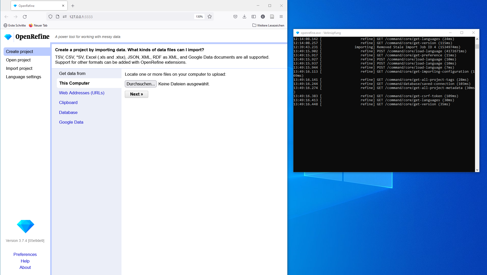

# Anwendungsbeispiel

Folgendes Beispiel stammte aus der geraden laufenden Datenbankumstellung am Haus der Geschichte Baden-Württemberg (HdGBW). Der Wechsel erfolgt von einer Eigenentwicklung aus dem Jahre 2001 nach ImdasPro, unterstützt vom [BSZ](https://www.bsz-bw.de/MusIS.html).
Konkret geht es das Überspielen von Adressangaben zu Körperschaften aus dem Feld "Herkunft/Leihgeber" bei Objektdatensätzen. Die alte Datenbank enthält keinen Adress- oder sonstige Stammdatenverwaltung, was zum einem bedeutet, dass dieses Feld ein Freitextfeld ist, und zum anderen, dass die selben Informationen bei jedem Objektdatensatz erneut eingegeben werden müssen. Entsprechend variantenreich können die Einträge ausfallen.

Die Schreibanweisung für das Feld lautet: Name; Straße Hausnummer, PLZ Ort. Tatsächlich finden sich in den Feldinhalten Schreibvarianten, Typos und auch ausgelassene Informationen wie z. B. fehlende Straßennamen.

Für diese kleine Einführung in OpenRefine wurde von 25 exemplarischen Datensätzen die Inhalte des Feldes als Datengrundlage für die folgenden Übungen in der [Herkunft.xlsx](./datasets/Herkunft.xlsx) ausgelesen.

## Der IMDAS-Import

Für die Datenmigration werden die Daten in Exceltabellen in ausgelesen. 
Damit Imdas diese Datensätze akzeptiert, müssen die Tabellen bestimmte Anforderungen erfüllen, u. a. müssen die zu importierenden Felder in der richtigen Reihenfolge vorhanden sein, und bestimmte Felder setzen exakte Feldinhalte oder bestimmte Formatierungen voraus.

In diesem Beispiel gehen wir davon aus, dass für das Einspielen der Körperschaften die Felder `Nachname`, `Strasse`, `PLZ`, `Ort`, `Staat`, `Normdaten` enthalten sein.

`Ort` ist in IMDAS ein Thesaurusfeld: für den Import muss der Thesauruspfad des gemeinten Ortsbegriffs hinterlegt sein. 
Am HdGBW wird für Orte innerhalb Deutschlands der BSZ-Ortsthesaurus verwendet, für alle anderen Orte die [GeoNames-Schnittstelle in IMDAS](https://abi-update.joanneum.at/dokumentation/imdas%20pro.html?GeoNamesSchnittstelle.html).
Beispiele:
- Mannheim: `Deutschland <DE>§Baden-Württemberg <BL>§Regierungsbezirk Karlsruhe <RB>§Rhein-Neckar <Reg>§Stadtkreis Mannheim <Kr>§Mannheim <Gm>§Mannheim <O>`
- Paris: `Erde§Europa§Frankreich§Île-de-France§Paris§Paris`

Einträge in `Normdaten` müssen dem Schema `O-GND~{GND-ID}~http://d-nb.info/gnd/{GND-ID}` folgen.
Beispiel für das HdGBW: `O-GND~5071403-X~https://d-nb.info/gnd/5071403-X`

Ein Eintrag wie 

> `Österreichische Nationalbibliothek, Josefsplatz 2, A-1015 Wien`

muss also geändert werden zu:

>| Nachname | Strasse | PLZ | Ort | Staat | Normdaten |
>| -------- | ------- | --- | --- | ----- | --------- |
>| Österreichische Nationalbibliothek | Josefsplatz 2 | A-1015 | Erde§Europa§Österreich§Wien§Wien§Wien | A | O-GND\~2020893-5\~https://d-nb.info/gnd/2020893-5 |

Dies soll mit Hilfe von OpenRefine in vier Schritten geschehen:

1. Zunächst sollen alle Angaben vereinheitlicht werden, um dann die Dubletten zu entfernen.
2. Danach sollen die Angaben auf die Felder aufgeteilt werden.
3. Als nächstes erfolgt der Abgleich mit der GND, um die GND-IDs und URIs zu ergänzen.
4. Schließlich sollen anhand der GeoNames-IDs die benötigten Thesauruspfade als Ortsangabe ergänzt werden. 

Doch bevor wir dies erledigen können, brauchen wir ggf. noch OpenRefine.

## OpenRefine installieren und Daten einlesen

Laden Sie die [neueste Version von OpenRefine](https://openrefine.org/download) für Ihr Computersystem herunter und entpacken Sie das Archiv-File am gewünschten Ort.
Wenn Sie OpenRefine starten, öffnet sich zunächst ein Terminal-Fenster, dann der Browser mit der Benutzeroberfläche.
Im Terminal läuft eigentlich das Programm - (nur) wenn Sie dieses schließen, beenden Sie auch OpenRefine.
Der Browser dient nur als Interface - das Programm läuft auf Ihrem Rechner, und die Daten werden beim Laden auch nicht online abgespeichert.

*Links das Browserfenster mit dem Userinterface, rechts das laufende Programm im Terminalfenster*

Speichern Sie nun die Datei [Herkunft.xlsx](./datasets/Herkunft.xlsx) aus diesem Repository auf ihrem Computer.

Über den Button `Durchsuchen...` können Sie die Datei nun in OpenRefine öffnen.
Nach klicken auf `next` zeigt OpenRefine den Dateiinhalt (maximal die ersten 100 Zeilen) in einem Vorschaufenster. OpenRefine erkennt in der Regel das vorliegende Dateiformat automatisch, ebenso die Datentypen und Spaltenüberschriften. Sollte dennoch etwas nicht stimmen, gäbe es hier noch die Möglichkeit für einige Korrekturen. 
Sollte dies nicht der Fall sein, erstellen Sie das Projekt durch Klick auf den Button `Create project` oben rechts.

## Daten vereinheitlichen

## Informationen aufteilen

## Normdatenabgleich

## Thesauruspfade via GeoNamesID ergänzen

[Vorige Seite](1_Was_ist_OpenRefine.md) | [Inhaltsverzeichnis](README.md) | [Nächste Seite](3_Fazit.md)
