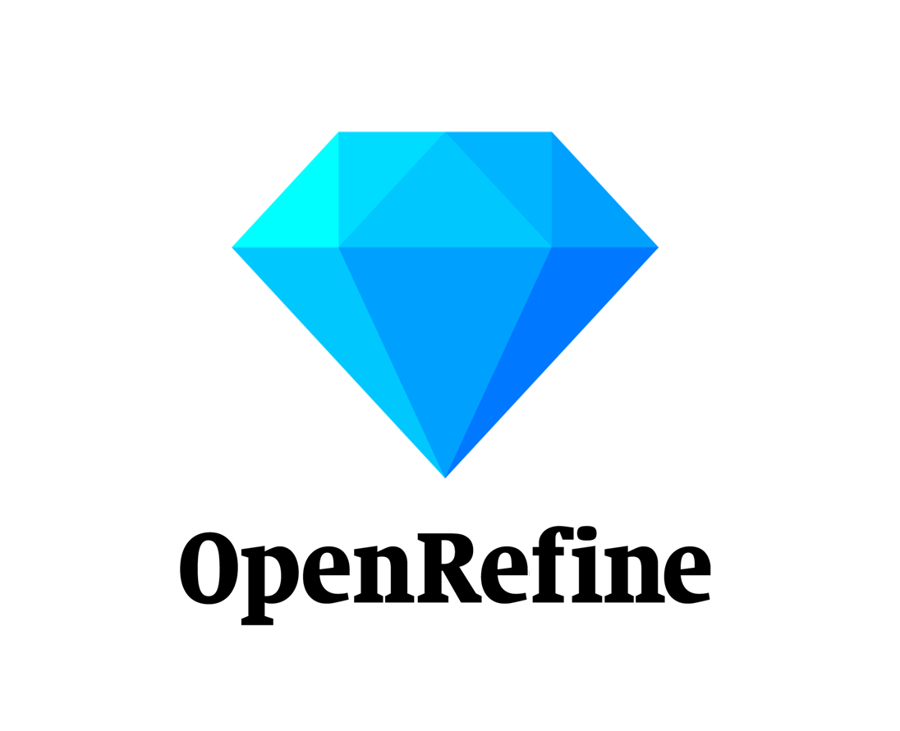

# Was ist OpenRefine?

## Die Basics

OpenRefine ist eine **kostenlose Open-Source-Software** zur **Bereinigung und Aufbereitung von (unstrukturierten) Daten**.
Genauer gesagt ermöglicht sie es, Daten aus unterschiedlichen Quellen zu laden, zu sichten und zu filtern, zu transformieren, mit externen Daten anzureichern und in eine Vielzahl von Formaten wieder zu exportieren.

OpenRefine basiert auf einer Entwicklung der [Freebase](https://en.wikipedia.org/wiki/Freebase_(database))-Designern [Metaweb](https://en.wikipedia.org/wiki/Metaweb), die 2010 von Google aufgekauft wurden.
Seitdem 2012 Google die Arbeiten an OpenRefine eingestellt hatte, wird die Weiterentwicklung der damals "GoogleRefine" genannten Software von der **Opensource-Community** unter dem nun bekannten Namen fortgesetzt. 

OpenRefine läuft auf allen Plattformen (Windows, Mac, Linux) und benötigt als **Systemvoraussetzung** Java sowie einen der gängigen Browser (Google Chrome, Chromium, Opera, Microsoft Edge, Safari, Firefox).

> [!NOTE]
> Der Browser dient nur als user interface, das Programm läuft aber lokal.

## OpenRefine ist leicht zu lernen

Dank verschiedener Features ist es sehr leicht, sich in OpenRefine einzuarbeiten:
- Die Daten werden in einem eigenen Arbeitsspeicher geladen. Der **Originaldatensatz wird** durch die Operationen in OpenRefine **nicht veränder**! Dies erleichtert es, neue Funktionen einfach mal auszuprobieren.
- Bei bestimmten Operationen wird das Resultat in einer **Vorschau** angezeigt. So kann sichergestellt werden, dass die eingestellte Transformation auch zum beabsichtigten Ergebnis führt.
- **Undo/Redo**: Die meisten Arbeitsschritte werden in einer Operation-History automatisch geloggt, so dass zu jedem vorherigen Arbeitszustand zurückgekehrt werden kann.
- Die gängisten Funktionsweisen sind über **Menüs** ausfürbar.
- Zu OpenRefine gibt es eine **gute Dokumentation**, sowohl intern, als auch durch eine sehr aktive Community. Dazu mehr im [Fazit](3_Fazit.md)

## OpenRefine ist vielfältig

OpenRefine hat ein extrem vielseitiges **Einsatzspektrum**:
- Import/Export:
  - Dateiformate: CSV, TSV, Text files, JSON, XML, ODS, XLS, XLSX , MARC, RDF, Wikitext, …
  - Datenquellen: Lokale Datei(en), ZIP Archive, URL, Clipboard, SQL, Google Sheet, Wikidata, …
- Abgleich mit Normdateien (reconciliation)
- Fetchen von Websites/API calls
- Schnittstelle zu Wikidata

Zudem bietet es **verschiedene Eingabemöglichkeiten** für User mit unterschiedlichen Kompetenzen an:
- Die wichtigsten Funktionen sind über die Menüs neben den Spaltenbezeichnungen abrufbar.
- Für umfangreichere Operationen steht die OpenRefine-eigene Programmiersprache *GREL* zur Verfügung (s. [Manual](https://openrefine.org/docs/manual/grelfunctions)).
- Schließlich ist in OpenRefine standardmäßig auch die Java-Implementierung von Python *Jython* installiert, was den Zugriff auf die weite Welt der Python- sowie Java-Programmbibliotheken ermöglicht. Zusätzlich wird auch *Clojure* unterstützt.

Und dank der umtriebigen Community gibt es auch diverse **Erweiterungen**, die weitere Funktionalität ergänzen:  [hier eine offizielle Liste](https://openrefine.org/extensions). 
 
[Vorige Seite](../README.md) | [Inhaltsverzeichnis](../README.md) | [Nächste Seite](./2_Anwendungsbeispiel.md)