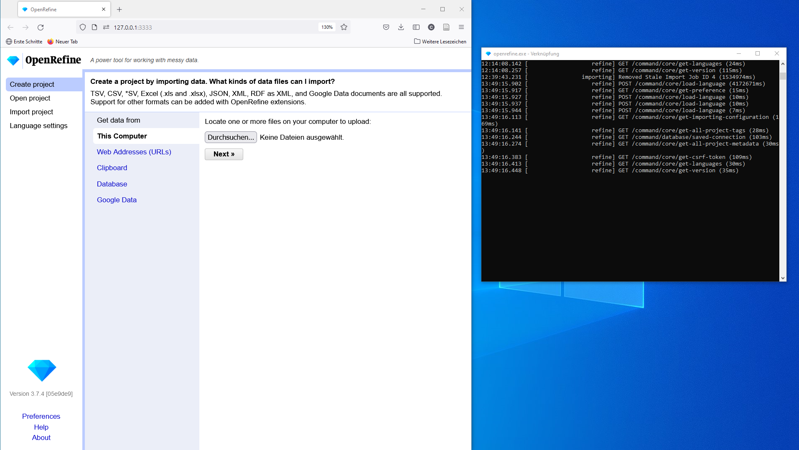

## OpenRefine installieren und Daten einlesen

Laden Sie die [neueste Version von OpenRefine](https://openrefine.org/download) für Ihr Computersystem herunter und entpacken Sie das Archiv-File am gewünschten Ort.
Wenn Sie OpenRefine starten, öffnet sich zunächst ein Terminal-Fenster, dann der Browser mit der Benutzeroberfläche.
Im Terminal läuft eigentlich das Programm - (nur) wenn Sie dieses schließen, beenden Sie auch OpenRefine.
Der Browser dient nur als Interface - das Programm läuft auf Ihrem Rechner, und die Daten werden beim Laden auch nicht online abgespeichert.

*Links das Browserfenster mit dem Userinterface, rechts das laufende Programm im Terminalfenster.*

Speichern Sie nun die Datei [Herkunft.xlsx](../data/Herkunft.xlsx) aus diesem Repository auf ihrem Computer.

Über den Button `Durchsuchen...` können Sie die Datei nun in OpenRefine öffnen.
Nach klicken auf `next` zeigt OpenRefine den Dateiinhalt (maximal die ersten 100 Zeilen) in einem Vorschaufenster. OpenRefine erkennt in der Regel das vorliegende Dateiformat automatisch, ebenso die Datentypen und Spaltenüberschriften. Sollte dennoch etwas nicht stimmen, gäbe es hier noch die Möglichkeit für einige Korrekturen. 
Sollte dies nicht der Fall sein, erstellen Sie das Projekt durch Klick auf den Button `Create project` oben rechts.

Es öffnet sich die Anzeige des Datensets, wobei standardmäßig nur die ersten 10 Zeilen angezeigt werden.
In der Kopfzeile über dem Datenset kann man mehr oder weniger Zeilen einblenden lassen und durch das gesamte Datenset navigieren.

[Vorige Seite](./2_1_IMDAS-Import.md) | [Inhaltsverzeichnis](../README.md) | [Nächste Seite](./2_3_Daten_vereinheitlichen.md)