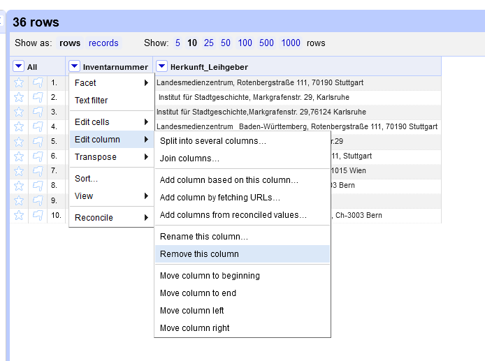
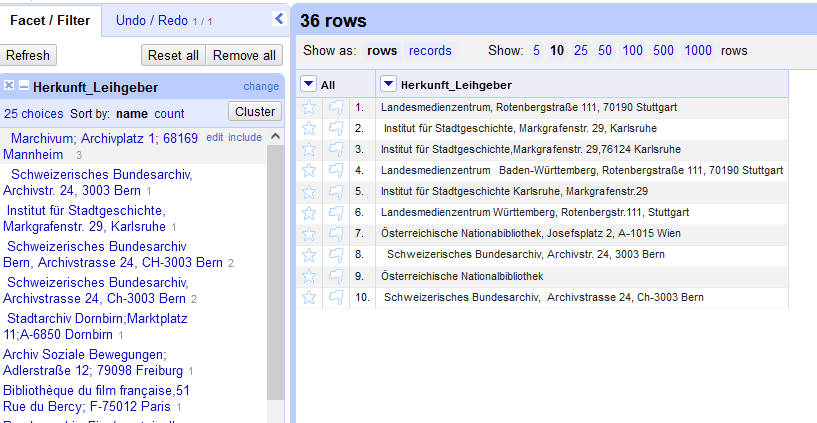
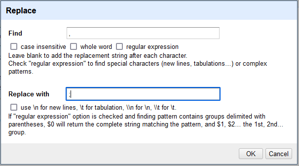
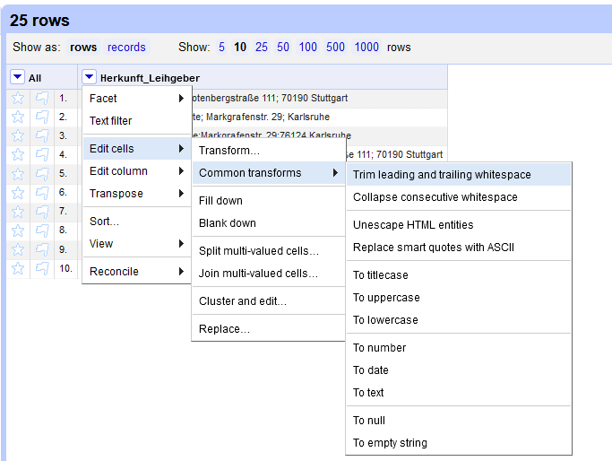
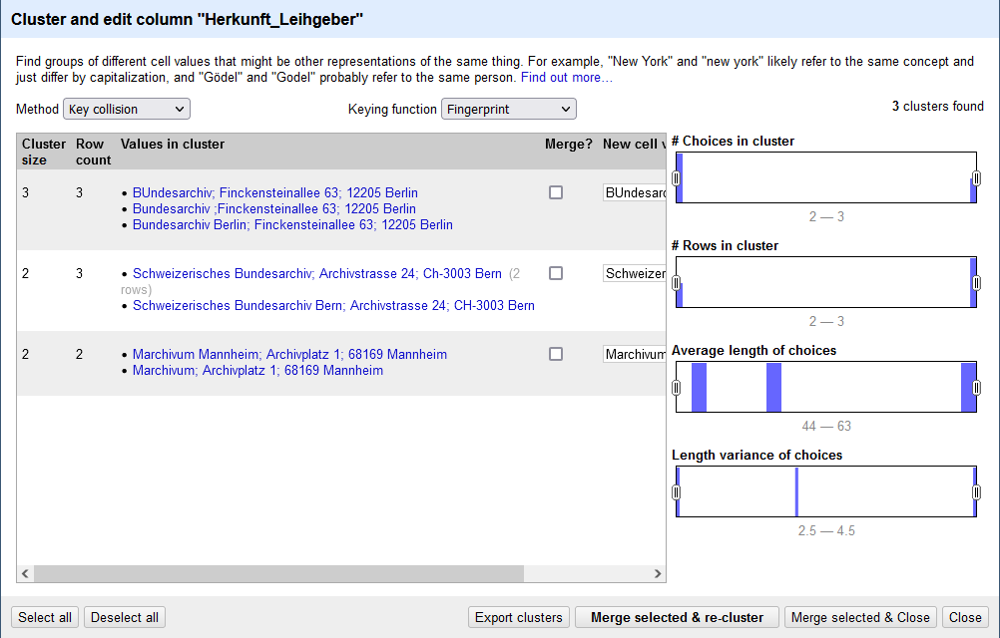
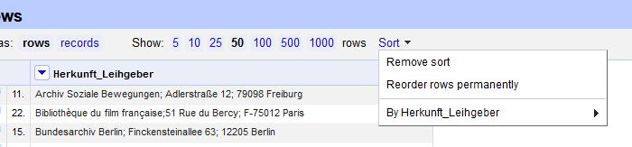

## Daten vereinheitlichen und Duplikate entfernen

### Datenbereinigung

Im Feld "Herkunft/Leihnehmer" kommen die selben Körperschaften in unterschiedlichen Schreibweisen mehrmals vor. 
Damit wir durch den Import in IMDAS nicht mehrerer Datensätze für die gleichen Entitäten erstellen lassen, müssen wir zunächst die Schreibweisen angleichen, um dann die doppelten Einträge entfernen zu können.

Doch zunächst entledigen wir uns der Spalte "Inventarnummer", indem wir im dropdown-Menü zur `Inventarnummer` "Edit column" und dann "Remove this column" auswählen.

*Entfernen der Spalte `Inventarnummer`.*

**Generell können die allermeisten Funktion zum Sichten, Filtern, Transformieren und Anreichern eines Datensets über die Dropdownmenüs neben den Spaltenbezeichnungen aufgerufen werden.**

Um die Inhalte einer Spalte zu sichten, eigenen sich Facets besonders gut.
So zeigt das "Text Facet" alle Werte an, die in der Spalte vorkommen, sowie deren Häufigkeit. 
Über die Facets lässt sich ein Datenset filtern.
Durch editieren der Facet-Werte lassen sich zudem Gruppenkorrekturen vornehmen.

*Das Text Facet der Spalte `Herkunft_Leihgeber`.*

Über den Punkt "Facet" im Dropdown-Menü wählen wir "Text facet" aus.
Daraufhin erstellt OpenRefine eine Übersicht zu allen Einträgen in dieser Spalte, die sich nach Name oder Häufigkeit sortieren lässt.
Bewegt man den Mauszeiger über einen Eintrag, erscheinen zudem die Aktionen "edit" -- um alle Zellen mit diesem Wert zu bearbeiten -- und "include", um mehrere Einträge zu einem Filter zu ergänzen.

Beim ersten Sichten der Datensätze fallen gleich zwei Probleme auf: 
Unerwünschte Leerzeichen und uneinheitliche Trennzeichen.

Letztere können wir via Dropdown über "Edit cells" -> "Replace..." angleichen, indem wir im sich darauf öffnenden Fenster unter "Find" ein `,` und unter "Replace with" ein `;` eingeben.

*Replace-Menü.*

Da Leerzeichen für den Menschen schwer zu erkennen sind, gibt es in OpenRefine zwei eigene Funktion speziell zum Entfernen von Leerzeichen: 
- "Trim leading and trailing whitespace" entfernt Leereichen am Anfang und Ende eines Eintrags
- "Collapse consecutive whitespace" ersetzt mehrere Leerzeichen hintereinander durch ein einziges.

Beide können über "Edit cells" -> "Common transforms" aufgerufen werden.

*Die voreingestellten Zellentransformationen.*

### Vereinheitlichung

Nun können wir anhand des Text Facets uns daran setzen, die Einträge anzupassen - doch es gibt noch eine bessere Möglichkeit: die cluster-Funktion.
Dafür klicken wir in der Kopfzeile des Text Facets auf den "Cluster"-Button - und rufen so eine der wichtigsten Funktion zur Datenbereinigung in OpenRefine auf.

*Zusammenstellung ähnlicher Werte durch Clustering.*

Mit Clustering gruppiert OpenRefine ähnliche Werte zueinander. 
Diese lassen sich einen Klick auf den bevorzugten Eintrag vereinheitlichen. 
Durch den Eingabeschlitz (in der Abbildung etwas verdeckt) lässt sich der gewünschte Wert auch unabhängig von den vorgefundenen Einträgen anpassen.

Über "Method" und "Keying function" lassen sich verschiedene Algorithmen ausprobieren. 
Meistens lohnt es sich, alle durchzuprobieren, was wir in diesem Falle auch machen.

### Duplikate entfernen

Da nun alle Schreibvarianten beseitigt sind, können wir nun die Duplikate löschen. 
Da es in OpenRefine keine Funktion dazu gibt, muss man ein bisschen tricksen.

Zunächst lassen wir die Spalte über das Dropdown-Menü sortieren.
OpenRefine sortiert nun für uns die Werte alphabetisch, behält aber die ursprüngliche Sortierung noch im Speicher. 
Erst wenn wir über das in der Kopfzeile aufgetauchte `Sort`-Menü  `Reorder rows permanently` ausgewählt haben, wird die neue Sortierung fixiert.

*Das Sortierungsmenü in der Kopfzeile steht erst nach einer Sortierung zur Verfügung.*

Diese Fixierung ermöglicht es aber nun, über das Spalten-Menü -> `Edit cells` -> `Blank down` auszuwählen.
Nun werden alle aufeinanderfolgenden Dubletten gelöscht.

Mit dem Facet für leere Zellen über Spalten-Menü -> `Facet` -> `Customized facets` -> `Facet by blank (null or empty string)` können entweder alle Zeilen mit oder ohne Werten in dieser Spalte ausgewählt werden.
Mit `true` filtern wir die leeren Zeilen heraus, und können diese nun entfernen lassen, indem über das Dropdown-Menü in der ersten Spalte `All` -> `Edit rows` -> `Remove matching rows` aktiviert wird.

Zurück bleiben nur die Zeilen mit -- in diesem Falle eindeutigen -- Werten.

[Vorige Seite](./2_2_Installation.md) | [Inhaltsverzeichnis](../README.md) | [Nächste Seite](./2_4_Informationen_aufteilen.md)