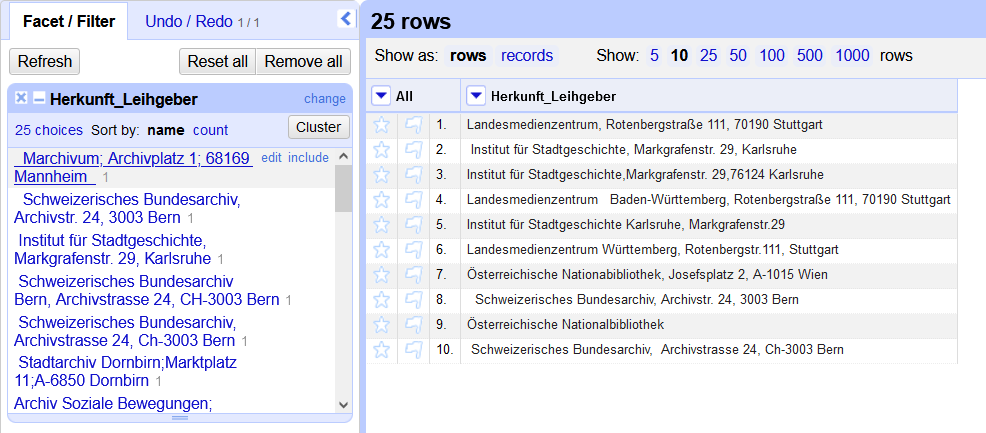

## Daten vereinheitlichen und Duplikate entfernen

### Datenbereinigung

Im Feld "Herkunft/Leihnehmer" kommen die selben Körperschaften in unterschiedlichen Schreibweisen mehrmals vor. 
Damit wir durch den Import in IMDAS nicht mehrerer Datensätze für die gleichen Entitäten erstellen lassen, müssen wir zunächst die Schreibweisen angleichen, um dann die doppelten Einträge entfernen zu können.

Doch zunächst entledigen wir uns der Spalte `Inventarnummer`, indem wir im dropdown-Menü zur `Inventarnummer` `Edit column` und dann `Remove this column` auswählen.

*Entfernen der Spalte `Inventarnummer`.*

> [!IMPORTANT]
> Generell können die allermeisten Funktion zum Sichten, Filtern, Transformieren und Anreichern eines Datensets über die Dropdownmenüs neben den Spaltenbezeichnungen aufgerufen werden.

Um die Inhalte einer Spalte zu sichten, eigenen sich Facets besonders gut.
So zeigt das "Text Facet" alle Werte an, die in der Spalte vorkommen, sowie deren Häufigkeit. 
Über die Facets lässt sich ein Datenset auch filtern.
Durch Editieren der im Facet angezeigten Werte lassen sich zudem Gruppenkorrekturen vornehmen.
Über den Punkt `Facet` im Dropdown-Menü wählen wir `Text facet` aus.

*Das Text Facet der Spalte `Herkunft_Leihgeber`.*

Daraufhin erstellt OpenRefine an der Sidebar eine Übersicht zu allen Einträgen in dieser Spalte, die sich nach Name oder Häufigkeit sortieren lässt.
Bewegt man den Mauszeiger über einen Eintrag, erscheinen zudem die Aktionen `edit` -- um alle Zellen mit diesem Wert zu bearbeiten -- und `include`, um mehrere Einträge zu einem Filter zu ergänzen.

Beim ersten Sichten der Datensätze fallen in unserem Beispiel gleich zwei Probleme auf: 
Unerwünschte Leerzeichen und uneinheitliche Trennzeichen.

Letztere können wir via Spaltenmenü über `Edit cells` -> `Replace...` angleichen.
Es öffnet sich ein Dialogfenster, indem wir "Find" ein `,` und unter "Replace with" ein `;` eingeben.

*Das Replace-Menü.*

Da Leerzeichen für den Menschen schwer zu erkennen sind, gibt es in OpenRefine zwei eigene Funktion, um diese zu entfernen: 
- `Trim leading and trailing whitespace` entfernt Leereichen am Anfang und Ende der Zellen.
- `Collapse consecutive whitespace` ersetzt mehrere Leerzeichen hintereinander durch ein einziges.

Beide können über `Edit cells` -> `Common transforms` aufgerufen werden.

*Die voreingestellten Zellentransformationen.*

### Vereinheitlichung

Nun könnten wir mit der `edit`-Funktion des Text Facets uns daran setzen, die Einträge anzupassen - doch es gibt noch eine bessere Möglichkeit: die cluster-Funktion.
Zu dieser gelangen wir über den `Cluster`-Button in der Kopfzeile des Text Facets.

*Zusammenstellung ähnlicher Werte durch clustering.*

Dieses clustering gruppiert ähnliche Werte zueinander, die dann durch Auswahl des bevorzugten Eintrags vereinheitlich werden können.
Durch den Eingabeschlitz (in der Abbildung etwas verdeckt) lässt sich der gewünschte Wert auch unabhängig von den vorgefundenen Einträgen anpassen.

Über die Dropdown-Menüs `Method` und `Keying function` lassen sich verschiedene Algorithmen ausprobieren. 
Meistens lohnt es sich, alle durchzuprobieren und die gewünschten Anpassungen vorzunehmen, was wir in diesem Falle auch machen.

### Duplikate entfernen

Da nun alle Schreibvarianten beseitigt wurden, können wir nun die Duplikate löschen. 
In OpenRefine gibt es allerdings keine spezielle Funktion dazu, daher müssen wir nun ein bisschen tricksen.

Zunächst lassen wir die Spalte über ihr Menü sortieren (Spaltenmenü -> `Sort...`).
Beim sich öffnenden Fenster muss nichts angepasst werden und wir bestätigen die Sortierung mit `OK`.

Auch wenn die Anzeige sich nun ändert, behält OpenRefine die ursprüngliche Sortierung noch im Speicher. 
Erst wenn wir über das in der Kopfzeile aufgetauchte `Sort`-Menü  `Reorder rows permanently` ausgewählt haben, wird die neue Sortierung fixiert.

*Das Sortierungsmenü in der Kopfzeile steht erst nach einer Sortierung zur Verfügung.*

Diese Fixierung ermöglicht es aber nun, über das Spalten-Menü -> `Edit cells` -> `Blank down` auszuwählen.
Mit `Blank down` werden alle *aufeinanderfolgenden* Dubletten gelöscht.

Mit dem Text Facet lassen sich auch die leeren Zeilen auswählen, indem wir hier an letzter Stelle `(blank)` anklicken.
Schließlich entfernen wir sie, indem über das Dropdown-Menü in der ersten Spalte `All` -> `Edit rows` -> `Remove matching rows` ausgewählt wird.

Zurück bleiben nur die Zeilen mit - in diesem Falle eindeutigen - Werten, wovon wir uns mit einem Blick in den Text Facet überzeugen können. 

[Vorige Seite](./2_2_Installation.md) | [Inhaltsverzeichnis](../README.md) | [Nächste Seite](./2_4_Informationen_aufteilen.md)