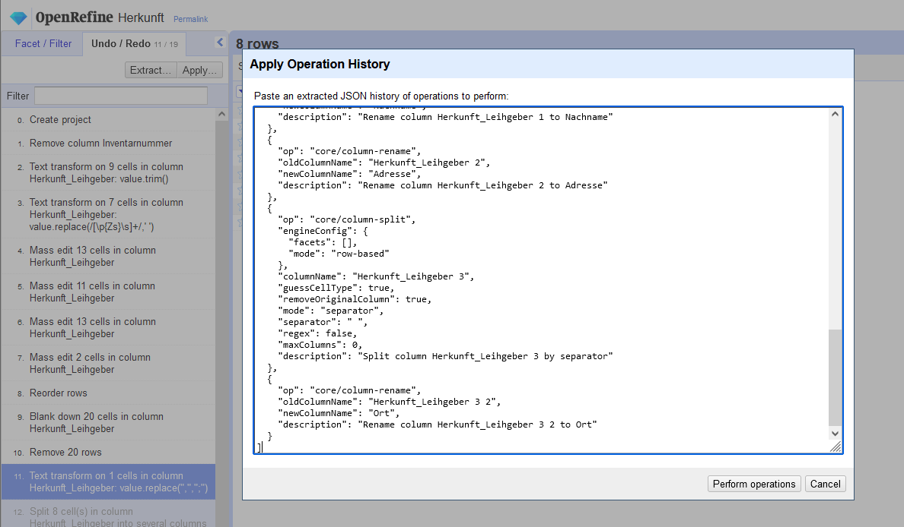
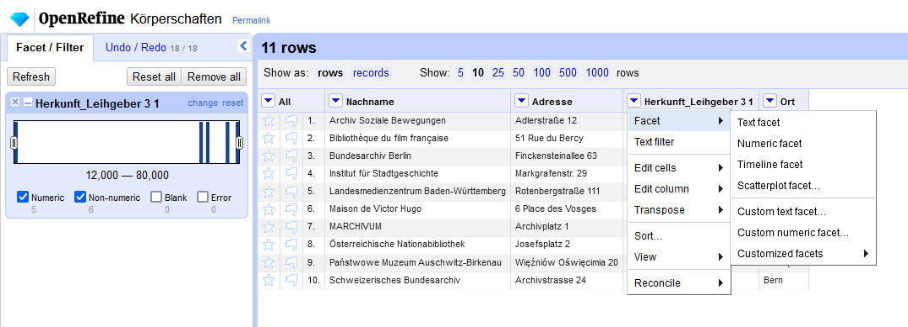
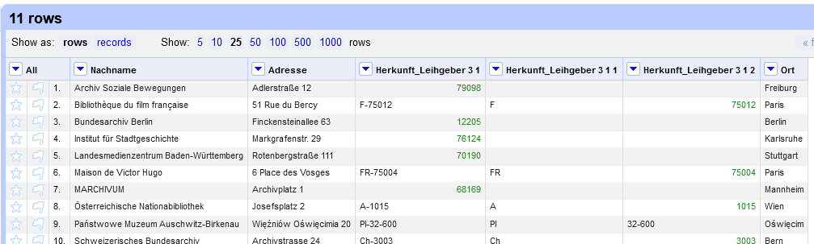

## Informationen aufteilen

Nachdem wir nun sichergestellt haben, dass jede Eintrag eindeutig ist, können wir uns daran machen, die Angaben auf die entsprechenden Zielfelder in IMDAS -- Nachname, Adresse, PLZ, Ort -- zu verteilen. Da das Feld "Normdaten" ein besonderes Vorgehen erfordert, werden es im Anschluss an diesen Schritt erzeugen.

### Variante 1: Spalten erstellen

Um die Spalte `Herkunft_Leihgeber` anhand des `;` in mehrere Spalten aufzuteilen geht man wieder in das Spaltenmenü -> `Edit colum` -> `Split into several columns...`, und gibt im sich öffnenden Fenster als Seperator `;` ein.

Da bei manchen Feldern den Semikolons ein Leerzeichen folgte, haben wir nun wieder ein paar Zellen mit Leerzeichen am Anfang.
Diese werden wir in allen Spalten los, wenn wir in der Spalte `All` -> `Edit all columns` -> `Trim leading and trailing whitesapce...` auswählen.

Wenn wir nun die erste und zweite Spalte über Spaltenmenü -> `Edit column` -> `Rename this column...` in `Nachname` und `Adresse` umbenannt haben, sind wir mit diesen fertig.

Die Spalte mit den Postleitzahlen und Orten teilen wir wieder anhand eines Trennzeichen auf, diesmal mit dem Leerzeichen ` ` als Delimiter.
Die so gewonnene zweite Spalte können wir auch gleich in `Ort` umbenennen.

### Variante 2: Operation History verwenden

Die im vorigen Abschnitt vorgenommenen Schritte sind bei der Aufbereitung von Daten aus dem Feld "Herkunft/Leihgeber" aus dieser Spalte immer gleich.
Für solche Fälle bietet sich die Exportfunktion der Operation history an: 
Aus jedem Projekt können Arbeitsschritte (komplett oder auszugsweise) im JSON-Format exportiert werden, um sie in einem anderen Projekt zu laden.
Dies ermöglicht eine gewisse Form der Automatisierung repetitiver Aufgaben bei gleich strukturierten Datensets.

Um nun die oben beschrieben Transformation zu laden, öffnen Sie die (Spalten_erstellen.json)[./data/Spalten_erstellen.json] mit einem einfachen Texteditor und kopieren Sie den Inhalt in das Fenster "Apply Operation History", dass Sie im "Undo/Redo"-Seitenpanel mit dem Button "Apply..." öffnen können.

*Die in JSON verfassten Arbeitsschritte aus der Datei "Spalten_erstellen.json" im Apply Operation History-Fenster.*

Mit einem Klick auf "Perform operations" werden alle enthaltenen Transformationen umgesetzt.

### Staat-Spalte aus gefilterter PLZ-Spalte

Als letztes bleibt, noch die `Staat`-Spalte mit den Länderkürzeln aus den Postleitzahlen zu gewinnen.

In der Spalte davor mit den Postleitzahlen hat sich nun in der Darstellung etwas geändert, denn alle Postleitzahlen ohne Länderkennung sind nun grün.
Dies bedeutet, dass OpenRefine die Werte in diesen Zellen als Datentyp "Nummer" erkannt hat, während die schwarze Schrift für den Datentyp "Text" steht.[^1]

Um bestimmte Zeilen von Datentransformationen auszuschließen, können in OpenRefine Facets und Filter verwendet werden. 
Damit Beispielsweise die Spaltenaufteilung nach `-` bei den Postleitzahlen nur bei solchen mit Länderkürzel angewendet werden, können wir zunächst einen Numeric Facet erstellen, und dort anschließend den Datentyp "Numeric" abwählen.

*Aktivierter Numeric Facet in der Spalte mit den Postleitzahlen*

Nachdem wir so die Zeilen mit Nummern-Werten herausgefiltert haben, teilen wir die Spalte wieder über `Split into several columns ...` mit dem Separator `-` in mehrere Spalten auf.
Diesmal allerdings möchten wir die Originalspalte behalten, und entfernen daher den Haken bei "Remove this column".

Wenn wir danach den Numeric facet wieder entfernen, sehen wir, dass die split-Operation nur auf die Spalten mit Datentyp Text angewendet wurde. 

*Die Originalspalte mit den Postleitzahlen und das Ergebenis der Split-Operation bei aktiver Filterung*

Anschließend entfernen wir die Spalte mit den ausländischen Postleitzahlen, nennen die Spalte mit den Länderkürzeln zu `Staat` um, verschieben sie an das Ende des Datensets und ändern die Spaltenbezeichnung mit den Postleitzahlen zu `PLZ`.

[^1]: Andere Datentypen sind Boolsche Werte (`true`/`false`) und Datums- und Zeitangaben.

[Vorige Seite](./2_3_Daten_vereinheitlichen.md) | [Inhaltsverzeichnis](../README.md) | [Nächste Seite](./2_5_Normdatenabgleich.md)