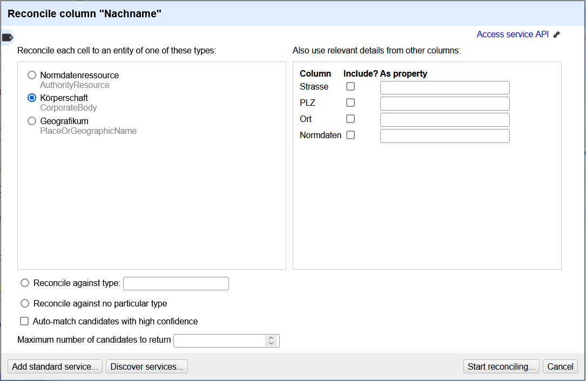

## Normdatenabgleich

In diesem Abschnitt gehen wir nun daran, Spalte `Nachname` mit den Datensätzen der [Gemeinsamen Normdatei](https://www.dnb.de/DE/Professionell/Standardisierung/GND/gnd_node) abzugleichen, um die GND-ID der Körperschaften zu erhalten. 
Ein solcher Abgleich mit einer externen Normdatei wird als "reconciling" bezeichnet.

Für die GND stellt das [Hochschulbibliothekszentrum des Landes NRW](https://www.hbz-nrw.de/produkte/linked-open-data) unter **https://lobid.org/gnd/reconcile/** einen entsprechenden Dienst zur Verfügung.[^2]

Um den Service nutzen zu können, müssen wir diese URL zunächst in OpenRefine hinterlegen.
Dafür wählen wir im Menü der Spalte `Nachname` -> `Reconcile` -> `Start reconcoling...` aus.
Im sich öffnenden Dialogfenster können wir dann die lobid-URL mit `Add standard sercice...` ergänzen.

Nun steht der Service als "GND reconciliation for OpenRefine" zur Verfügung.

Wird dieser ausgewählt, öffnet sich ein neues Fenster.
In diesem können wir im linken Bereich den abzugleichenden Entitätstyp auswählen, in unserem Fall also die "Körperschaft".

> [!IMPORTANT] 
> Den Haken bei `Auto-match candidates with high confidence` abwählen.
> Ansonsten erstellt OpenRefine automatisch matches zu GND-Einträgen mit hoher Übereinstimmung - was allerdings nicht immer die tatsächlich gemeinte Entität sein muss.

*Die Voreinstellungen zur reconciliation.*

Nach erfolgten Datenabgleich werden in den Zellen alle Datensätze angezeigt, die OpenRefine als ähnlich zum Zelleneintrag betrachtet.

*Das Ergebnis einer reconciliation mit Links zu GND-Datensätzen unter jedem Begriff.*

Unter jedem Begriff stehen nun Links zu vorgeschlagenen Datensatz in der GND - sofern OpenRefine mindestens einen möglichen Kandidaten in der GND gefunden hat.
Per Mouseover über den Link werden auch einige weiteren Informationen geladen - eine hilfreiche Funktion, um schnell zu sichten, ob es sich auch tatsächlich um die gesuchte Entität handelt.
Mit den Buttons `Match this cell` wird diese Zelle und mit `Match all identical cells` weden allen Zellen in der Spalte mit gleichem Wert diesem GND-Datensatz zugewiesen.
Sollten alle Vorschläge nicht stimmen - ggf. aufgrund eines Schreibfehlers in der Zelle -, kann über `Search for match` nach weiteren möglichen Matches in der GND gesucht werden, oder mit `Create new item` festgelegt werden, dass es keinen Match gibt.

Nachdem wir allen Werte so einen GND-Eintrag zugewiesen haben, können wir nun Daten aus der GND ergänzen - wie z. B. die GND-ID.
Dafür gibt es bei OpenRefine eine eigene Funktion, die über das Spaltenmenü -> `Reconcile` -> `Add entity identifiers column...` aufgerufen werden kann.
Als Spaltentitel wählen wir `Normdaten`.

Zur Erinnerung: die Inhalte dieser Spalte müssen dem Schema `O-GND~{GND-ID}~https://d-nb.info/gnd/{GND-ID}` folgen (s. Abschnitt [2.1](2_1_IMDAS-Import.md)).
Wir müssen also dem Zellenwert - der GND-ID - bestimmte Textbausteine voranstellen und anfügen. 

Dafür öffnen wir im Menü der Spalte `Normdaten` -> `Edit cells` -> `Transform...` das Fenster zur Eingabe von GREL-Expressions öffnen. 
Hier können nun diverse Transformationen mittels GREL durchgeführt werden.
Der Reiter "Help" listet eine kurze Dokumentation aller Funktionen auf.
`value` ist dabei der Stellvertreterterm für den tatsächlichen Zellenwert.
Da wir allerdings nur feste Textteile ergänzen wollen, kommen wir noch ohne Spezialfunktionen aus, und geben einfach nur folgendermaßen den gewünschten Textaufbau ein:

`"O-GND~" + value + "~https://d-nb.info/gnd/" + value`

Das Ergebnis der Transformation sehen wir im Preview. 

*Transformations-Fenster mit Vorschau auf das Resultat.*

Mit Klick auf den `OK`-Button wird die Spalte aktualisiert.
Anschließend können wir die `Normdaten` über Spaltenmenü -> `Edit Column` -> `Move column to end` ganz nach rechts verschieben.

[^2]: Siehe für eine Zusammenstellung von Diensten für OpenRefines reconciliation-api https://reconciliation-api.github.io/testbench/#/.

[Vorige Seite](./2_4_Informationen_aufteilen.md) | [Inhaltsverzeichnis](../README.md) | [Nächste Seite](./2_6_Thesauruspfade_ergänzen.md)