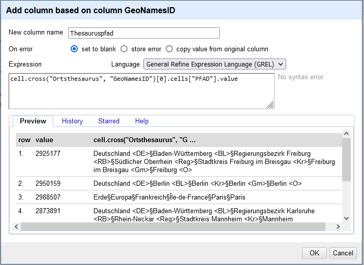

## Thesauruspfade via GeoNamesID ergänzen

Für den Import nach Imdas müssen wir als letztes die Ortsbezeichnungen mit den in IMDAS verwendeten Ortsthesauri abgleichen und den Thesauruspfad des entsprechenden Ortes eintragen.

Dafür benötigen wir zunächst den Export der Ortsthesauri in einem Tabellenformat, das insbesondere Spalten mit dem Pfad und mit der GeoNamesID enthält.
Als nächstes müssen wir in unsere Körperschafts-Tabelle wieder eine ID über eine reconciliation ergänzen, diesmal bei den Orten und mit einem Reconciliation-Service für GeoNames.
Schließlich nutzen wir in OpenRefine die GREL-Funktion `cross()`, die es uns erlaubt, Daten aus zwischen vorhandenen OpenRefine-Projekten auszustauschen.
Dies ermöglicht es uns, über die GeoNames-ID in unserer Tabelle die Pfade zum jeweiligen Ort aus der Thesaurus-Tabelle zu laden.

### Reconciliation mit GeoNames

Der Abgleich mit GeoNames läuft ähnlich wie [im Abschnitt vorher](#normdatenabgleich) beschrieben.
Als webservice für GeoNames geben wir unter `Add standard service...` die URL `https://fornpunkt.se/apis/reconciliation/geonames` ein.[^3]

Nach dem matchen der Ortsbegriffe mit GeoNames, können wir wieder über das Spaltenmenü -> `Reconcile` -> `Add entity identifiers column...` die GeoNames-IDs in einer eigenen Spalte ergänzen.

[^3]: Der von der schwedischen Citicen Science-Plattform fornpunkt.se angebotene reconciliation-service für GeoNames bietet weniger Funktion an als z. B. die GND-Schnittstelle von lobid. Ein alternativer Weg wäre, zunächst die Orte mit wikidata zu matchen, um aus wikidate die GeoNames-ID zu ergänzen. 

### Abgleich mit dem Thesaurusexport

Um nun die Pfade über die GeoNames-ID zu ergänzen, müssen wir zunächst die Excel-Tabelle mit den Thesaurusexport in OpenRefine laden.
Laden Sie sich für dieses Beispiel die Tabelle ["Thesauruspfade.xlsx"](../data/Thesauruspfade.xlsx) aus diesem Repository herunter.
Über den "Open..."-Button im oberen rechten Eck öffnet sich ein neuer Tab im Browser, und wir laden die Thesauruspfade.xlsx wie unter [weiter oben](#openrefine-installieren-und-daten-einlesen) beschrieben.
In der Vorschau geben wir dem neuen Projekt unter "Project name" den Namen  "Thesauruspfade".

Nun wechseln wir wieder in den Tab mit unseren Körperschafts-Daten.
Dort lassen wir aus der GeoNames-ID-Spalte eine neue Spalte erstellen (Spaltenmenü -> `Edit column` -> `Add column based on this column...`) mit dem Titel "Thesauruspfad".
In das Expression-Fenster geben wir nun die cross-Funktion ein:

`cell.cross("Thesauruspfade", "GeoNamesID")[0].cells["PFAD"].value`

Im Grunde bedeutet dieser Ausdruck:
1. `cell.corss("Thesauruspfade", "GeoNamesID")`: Gehe in das Projekt "Thesauruspfade" und Vergleiche die Werte in dieser Spalte mit der dortigen Spalte "GeoNamesID" ab.
2. `cells["PFADE"].value`: Bei gleichen Werten, ergänze hier den entsprechenden Wert aus der Spalte "PFAD" des Projektes "Thesauruspfade".

*Ergänzen der Thesauruspfade aus der Thesauruspfade.xlsx in die Körperschaften-Tabelle mittels `cross()`-Funktion.*

Nachdem wir uns über die Vorschau versichert haben, dass die Thesauruspfade korrekt übernommen werden, und wir die Transformation bestätigen, bleibt uns nur noch, die Spalten `Ort` und `GeoNamesID` zu löschen, und die Spalte `Thesauruspfad` in `Ort` umzubenennen.

Und wenn die Reihenfolge der Spalten [wie am Anfang genannt](#der-imdas-import) stimmt, haben wir nun eine für den Import nach Imdas fertig aufbereitete Tabelle mit Körperschaften.

[Vorige Seite](./2_5_Normdatenabgleich.md) | [Inhaltsverzeichnis](../README.md) | [Nächste Seite](./3_Fazit.md)